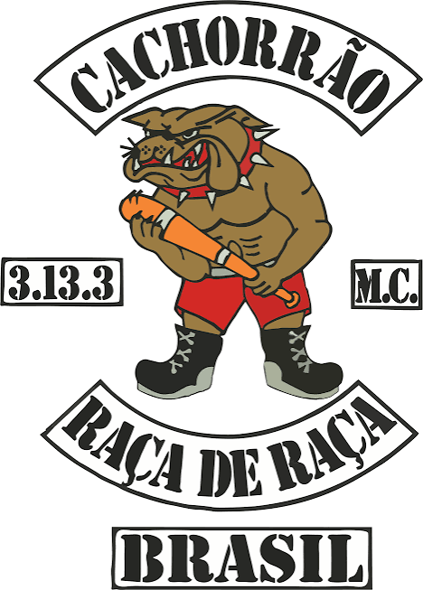

# sintaxe básica markdown / aula-dia-03.09
## Título secundario
### Terceiro

```
# sintaxe básica markdown / aula-dia-03.09
## Título secundario
### Terceiro
```
**Texto em negrito**

*Itálico*

~~corte~~

__louco__

## Listas

- Primeiro item
- Segundo item
  - Subitem identado
    - alto

1. Primeiro passo
2. Segundo passo
3. Terceiro passo

## checklists

- [x] Tarefa concluída
- [ ] Pendente

## links
````
[Visite o GitHub](https://github.com/Guxtoso/aula-dia03.09.git)

[simplenbasges]()

[Abra outro arquivo do projeto](exemplo.md)
````

## Código em linha e blocos de código

````
git status
git add .
git commit -m "Descrição"
git push origin main
````

## Citações

> Uma boa documentação explica o objetivo, o uso e as limitações de um projeto.

## Tabelas

| Tecnologia | Finalidade |
|--- | ---|
| Git | Controle de versões | 
 GitHub | Hospedagem e colaboração |
 Markdown | Documentação |

| Alinhando à esquerda | Alinhando ao centro | Alinhando à direita |
| :--- | :---: | ---: |
| Texto | Texto | Texto |

## Imagens




